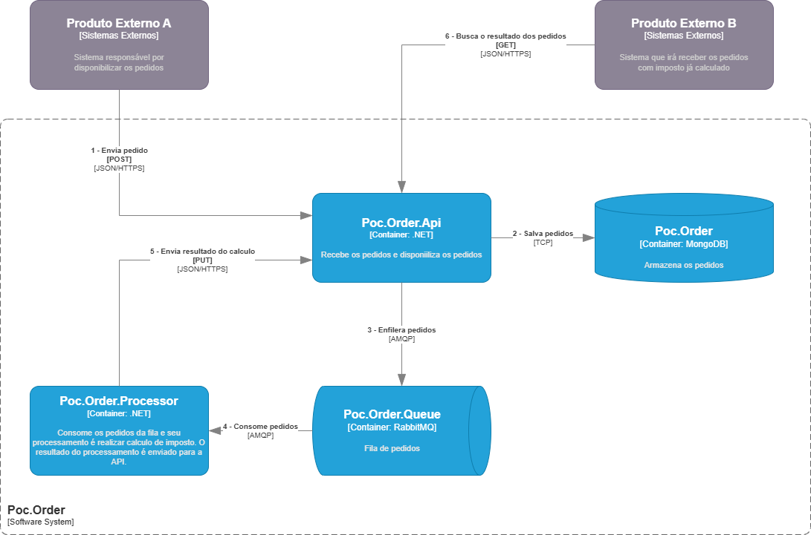

# Poc.Order
Este projeto tem o objetivo de resolver um desafio de desenvolvimento utilizando a tecnologia .NET e boas práticas de programação.

## Escopo
É uma solução para gerenciar e calcular os produtos de um pedido. No caso, os pedidos serão enviados por sistema externo chamado A, a solução recebe esse pedido, efetua o calculo de imposto e envia o mesmo para o Sistema externo B.

A volumetria levantada é que essa solução receberá aproximadamente 200 mil pedidos por dia.

A solução deve ser de fácil manutenção no calculo de imposto, possibilidade de ativar/desativar os calculos de imposto.

## Tecnologias
- .NET 8
- MongoDB
- RabbitMQ

## Diagrama de Container


### Decisões
No desenvolvimento, foi escolhido a arquitetura de microserviços junto com arquitetura limpa, para isolar e focar melhor no dominio da solução e atender a volumetria atual do requisito, além de ser uma arquitetura escalável quando a volumetria aumentar.

Idealmente, nessa arquitetura, seria melhor a criação de um repositório para cada microserviço, porém como é um conceito, os mesmos ficaram no mesmo local.

Teremos o microserviço *Poc.Order.Api* responsável por receber o pedido, validar campos, salvar no banco de dados (MongoDB) e disponibilizar os dados para consulta. O microserviço *Poc.Order.Processor* terá a única responsabilidade de realizar o calculo de imposto, e disponibilizar o resultado.

### Como executar localmente

#### Pré-requisitos
- Git
- Docker + Docker Compose instalados e ativos

#### Clonando o projeto

```bash
git clone https://github.com/brunodiego5/Poc.Order.git
cd Poc.Order/src
```
O arquivo ***docker-compose.yml*** está localizado na pasta ***src***

#### Subindo os containers

```bash
# 1. Parar e remover containers/volumes anteriores
docker compose down -v

# 2. Recriar as imagens do zero
docker compose build --no-cache

# 3. Subir todos os serviços em segundo plano
docker compose up -d --force-recreate

# 4. Visualizar logs em tempo real da API e do Processor
docker compose logs -f api processor
```

#### Acessos rápidos
- Swagger: http://localhost:8080/swagger
- Mongo Express: http://localhost:8081 (user: root, senha: root123)
- RabbitMQ: http://localhost:15672 (user: guest, senha: guest)

### Exemplos de uso da API

Você pode testar os endpoints da API após subir a aplicação com Docker (ver seção anterior).

#### Criar um novo pedido

**POST** `/api/pedido`

**Request:**

```json
{
  "pedidoId": 1,
  "clienteId": 1,
  "itens": [
    {
      "produtoId": 1001,
      "quantidade": 2,
      "valor": 52.70
    }
  ]
}
```

**Response esperado:**

```json
{
  "pedidoId": 1,
  "status": "Criado"
}
```
#### Consultar pedido por PedidoId

**GET** `/api/pedido/1`

**Response:**

```json
{
  "pedidoId": 1,
  "clienteId": 1,
  "imposto": 31.62,
  "itens": [
    {
      "produtoId": 1001,
      "quantidade": 2,
      "valor": 52.70
    }
  ],
  "status": "Concluido"
}
```
#### Listar pedidos filtrando por status

**GET** `/api/pedido?status=Concluido`

**Response:**

```json
[
  {
    "pedidoId": 1,
    "clientId": 1,
    "imposto": 7.2,
    "itens": [
      {
        "produtoId": 1,
        "quantidade": 3,
        "valor": 8
      }
    ],
    "status": "Concluido"
  }
]
```


### Próximos passos
- Implementar resiliência
- Implementar **rediness probe**
- Implementar fila para publicação dos resultados processados (Comunicação assíncrona com sistemas externos)
- Implementar notificação das validações em application para presentation
- Implementar para aplicação criar index no campo pedidoId da collection pedidos